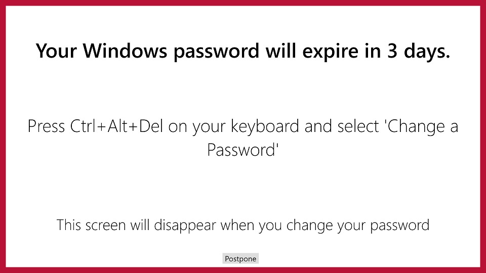

# Windows Password Notification

PowerShell login script or Unlock Script(Using Scheduled Task), that checks to see if the password is expiring soon and notifies the user.

## Check-Password.ps1

### SYNOPSIS
Check AD user's password expiration status and prompt the user to change if needed.

### SYNTAX

```powershell
Check-Password.ps1 [[-DaysToStart] <Int32>] [[-DaysToMaximizeWindow] <Int32>] [-LockScreenOnPasswordChange]
 [<CommonParameters>]
```

### DESCRIPTION
Displays a notification window for the user indicating that their password is about to or is expired, if within the defined parameters.
It bases the expiration off of the domain password policy.
The window notification gives instructions to user on how to change their password and gives them the choice to wait for the password change and make the window go away.
On the last day remaining the choice to postpone will be removed, forcing the user to change the password to remove the window.
The window will disappear automatically if it detects the user has changed their password.

### EXAMPLES

#### EXAMPLE 1
```powershell
Check-Password
```

Description: Will run with default values with no parameters specified.
The window will not pop up until password expiration is less than or equal to 7 days remaining. 
The window will not maximize to Fullscreen until less than or equal to 3 days remaining.

#### EXAMPLE 2
```powershell
Check-Password -DaysToStart 4 -DaysToMaximizeWindow 2
```

Description: The window will not pop up until password expiration is less than or equal to 4 days remaining. 
The window will not maximize to Fullscreen until less than or equal to 2 days remaining.

#### EXAMPLE 3
```powershell
Check-Password -DaysToStart 6 -DaysToMaximizeWindow 3 -LockScreenOnPasswordChange
```

Description: Same as Example 2, however, once the user has changed their password it will lock their workstation, forcing them to sign back in with their newly created password.

### PARAMETERS

#### -DaysToStart
The DaysToStart parameter specifies when to fist display the window based on how many days left until their password will expire.

```yaml
Type: Int32
Parameter Sets: (All)
Aliases:

Required: False
Position: 1
Default value: 7
Accept pipeline input: False
Accept wildcard characters: False
```

#### -DaysToMaximizeWindow
The DaysToMaximizeWindow specifies when to maximize the notification window to fullscreen based on how many days left until their password will expire.

```yaml
Type: Int32
Parameter Sets: (All)
Aliases:

Required: False
Position: 2
Default value: 3
Accept pipeline input: False
Accept wildcard characters: False
```

#### -LockScreenOnPasswordChange
The LockScreenOnPasswordChange will lock the screen after the user has changed their password, forcing them to re-enter the new password they created.

```yaml
Type: SwitchParameter
Parameter Sets: (All)
Aliases:

Required: False
Position: Named
Default value: False
Accept pipeline input: False
Accept wildcard characters: False
```

## Screenshots

### Small Window


### Full Screen




